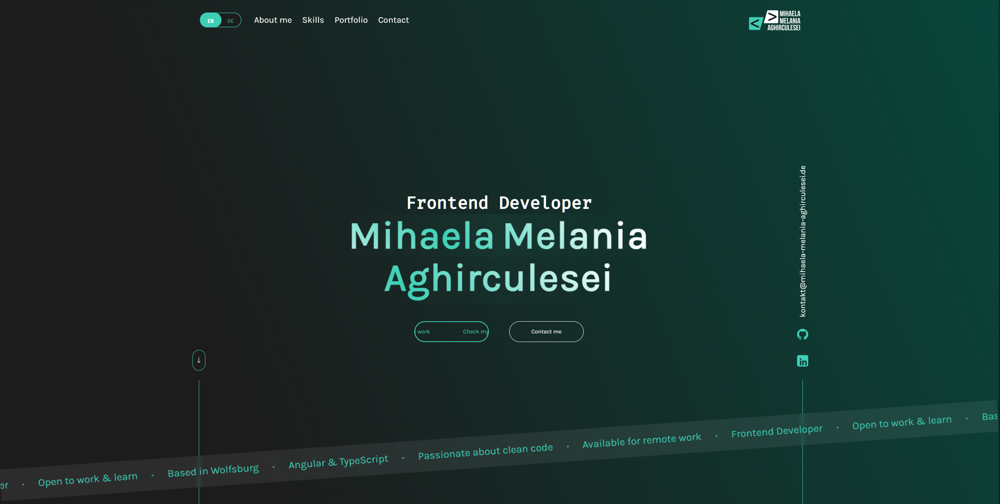
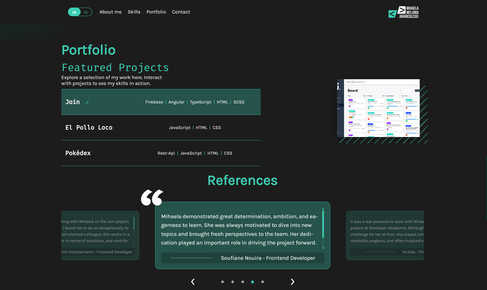

# 🚀 Portfolio - Mihaela Melania Aghirculesei

[](https://github.com/MihaelaAghirculesei/angular-portofolio/actions/workflows/ci.yml)
[](https://github.com/MihaelaAghirculesei/angular-portofolio/actions/workflows/codeql.yml)
[](LICENSE)
[](https://angular.io/)
[](https://www.typescriptlang.org/)

> A modern, performant, and fully accessible portfolio website built with Angular 17, showcasing best practices in web development.

[🌐 Live Demo](https://mihaela-melania-aghirculesei.de) • [📧 Contact](mailto:kontakt@mihaela-melania-aghirculesei.de)

---

## 📸 Preview

<div align="center">

### Landing Page

*Clean and modern hero section with call-to-action buttons*

<br>

### Portfolio Section

*Interactive project showcase with hover effects and detailed technology stack*

</div>

---

## ✨ Features

### 🎨 **Modern User Experience**
- ✅ Responsive design optimized for all devices
- ✅ Smooth animations and transitions
- ✅ Interactive project showcases with live previews
- ✅ Multi-language support (English/German)

### ⚡ **Performance Optimized**
- ✅ OnPush Change Detection Strategy
- ✅ Lazy loading for routes
- ✅ Server-Side Rendering (SSR) ready
- ✅ Optimized bundle size

### ♿ **Accessibility First**
- ✅ WCAG 2.1 Level AA compliant
- ✅ Full keyboard navigation
- ✅ ARIA labels and live regions
- ✅ Focus trap management
- ✅ Screen reader optimized

### 🔒 **Security & Quality**
- ✅ Content Security Policy (CSP) headers
- ✅ Automated security scanning with CodeQL
- ✅ Comprehensive error handling
- ✅ Input sanitization
- ✅ Type-safe with TypeScript strict mode

### 🧪 **Testing & CI/CD**
- ✅ Automated testing with Karma/Jasmine
- ✅ Code coverage tracking
- ✅ ESLint with strict rules
- ✅ GitHub Actions CI/CD pipeline
- ✅ Automated dependency reviews

---

## 🛠️ Tech Stack

### **Core**
- **Framework:** Angular 17.3 (Standalone Components)
- **Language:** TypeScript 5.4
- **Styling:** SCSS with responsive design
- **Internationalization:** @ngx-translate

### **Development**
- **Testing:** Karma, Jasmine
- **Linting:** ESLint, @angular-eslint
- **Build:** Angular CLI
- **CI/CD:** GitHub Actions

### **Key Features**
- Reactive Forms with custom validation
- RxJS for state management
- Server-Side Rendering (Angular SSR)
- Custom directives and pipes
- Centralized logging service

---

## 📦 Installation

### Prerequisites
- Node.js (v20.x or higher)
- npm (v10.x or higher)

### Setup

```bash
# Clone the repository
git clone https://github.com/MihaelaAghirculesei/angular-portofolio.git

# Navigate to project directory
cd angular-portofolio

# Install dependencies
npm install
```

---

## 🚀 Development

```bash
# Start development server
npm start

# Navigate to http://localhost:4200
```

The application will automatically reload when you make changes to the source files.

### Available Scripts

| Command | Description |
|---------|-------------|
| `npm start` | Start development server |
| `npm run build` | Build for production |
| `npm test` | Run unit tests |
| `npm run lint` | Run ESLint |
| `npm run lint:fix` | Fix ESLint errors automatically |

---

## 🏗️ Build

```bash
# Production build
npm run build

# Output location: dist/angular-portofolio
```

The build artifacts will be optimized for production with:
- Minification
- Tree-shaking
- Ahead-of-Time (AOT) compilation
- Bundle optimization

---

## 🧪 Testing

```bash
# Run tests
npm test

# Run tests with coverage
npm test -- --code-coverage

# Run tests in headless mode (CI)
npm test -- --watch=false --browsers=ChromeHeadless
```

### Test Coverage
- Comprehensive unit tests for components and services
- Integration tests for critical user flows
- Mock implementations for external dependencies

---

## 📁 Project Structure

```
src/
├── app/
│   ├── main-content/           # Feature modules
│   │   ├── about-me/
│   │   ├── contact/
│   │   ├── feedback/
│   │   ├── landing-page/
│   │   ├── legal-notice/
│   │   ├── portofolio/
│   │   ├── privacy-policy/
│   │   └── skills/
│   ├── shared/                 # Shared resources
│   │   ├── components/
│   │   ├── constants/
│   │   ├── directives/
│   │   ├── interfaces/
│   │   └── services/
│   └── layout/                 # Layout components
│       ├── header/
│       └── footer/
├── assets/                     # Static assets
│   ├── i18n/                  # Translation files
│   └── img/                   # Images
└── environments/              # Environment configs
```

---

## 🔧 Configuration

### Environment Variables

The project uses environment-based configuration for different deployment stages:

**Development** (`src/environments/environment.ts`)
```typescript
export const environment = {
  production: false,
  apiUrl: 'https://mihaela-melania-aghirculesei.de',
  enableLogging: true
};
```

**Production** (`src/environments/environment.prod.ts`)
```typescript
export const environment = {
  production: true,
  apiUrl: 'https://mihaela-melania-aghirculesei.de',
  enableLogging: false
};
```

### ESLint Configuration

The project enforces strict code quality standards:
- No `any` types
- No `console.*` calls in production
- Explicit return types
- Consistent naming conventions
- OnPush change detection required
- WCAG accessibility rules

---

## 🎯 Key Highlights

### **Code Quality**
- ✅ **Zero `any` types** - Full type safety with TypeScript
- ✅ **Centralized logging** - Custom LoggerService replacing console calls
- ✅ **Environment configuration** - Externalized configuration for easy deployment
- ✅ **Strict ESLint rules** - Automated code quality enforcement
- ✅ **OnPush everywhere** - Optimized change detection

### **Architecture**
- ✅ **Standalone components** - Modern Angular architecture
- ✅ **Lazy loading** - Optimized initial load time
- ✅ **Service-based state** - Clean separation of concerns
- ✅ **Interface-driven** - Strong typing throughout
- ✅ **Reactive patterns** - RxJS for async operations

### **User Experience**
- ✅ **Mobile-first design** - Responsive across all devices
- ✅ **Smooth interactions** - CSS animations and transitions
- ✅ **Form validation** - Real-time feedback
- ✅ **Error handling** - User-friendly error messages
- ✅ **Loading states** - Clear visual feedback

---

## 🚢 Deployment

### Production Build

```bash
npm run build -- --configuration=production
```

### CI/CD Pipeline

The project uses GitHub Actions for automated:
- ✅ Linting
- ✅ Testing with coverage
- ✅ Production builds
- ✅ Security scanning (CodeQL)
- ✅ Dependency reviews

---

## 📊 Performance

- Optimized bundle size with code splitting
- Lazy loading for improved initial load time
- OnPush change detection for better runtime performance
- Production builds with AOT compilation

---

## 🤝 Contributing

This is a personal portfolio project, but suggestions and feedback are welcome!

1. Fork the repository
2. Create your feature branch (`git checkout -b feature/AmazingFeature`)
3. Commit your changes (`git commit -m 'Add some AmazingFeature'`)
4. Push to the branch (`git push origin feature/AmazingFeature`)
5. Open a Pull Request

---

## 📄 License

This project is licensed under the MIT License - see the [LICENSE](LICENSE) file for details.

---

## 👤 Author

**Mihaela Melania Aghirculesei**

- 🌐 Website: [mihaela-melania-aghirculesei.de](https://mihaela-melania-aghirculesei.de)
- 💼 LinkedIn: [mihaela-aghirculesei](https://www.linkedin.com/in/mihaela-aghirculesei-84147a23b/)
- 📧 Email: kontakt@mihaela-melania-aghirculesei.de
- 💻 GitHub: [@MihaelaAghirculesei](https://github.com/MihaelaAghirculesei)

---

## 🙏 Acknowledgments

- Angular Team for the amazing framework
- Developer Academy for the training and support
- The open-source community for invaluable tools and libraries

---

<div align="center">

**⭐ If you find this project interesting, please consider giving it a star! ⭐**

Made with ❤️ and Angular

</div>
