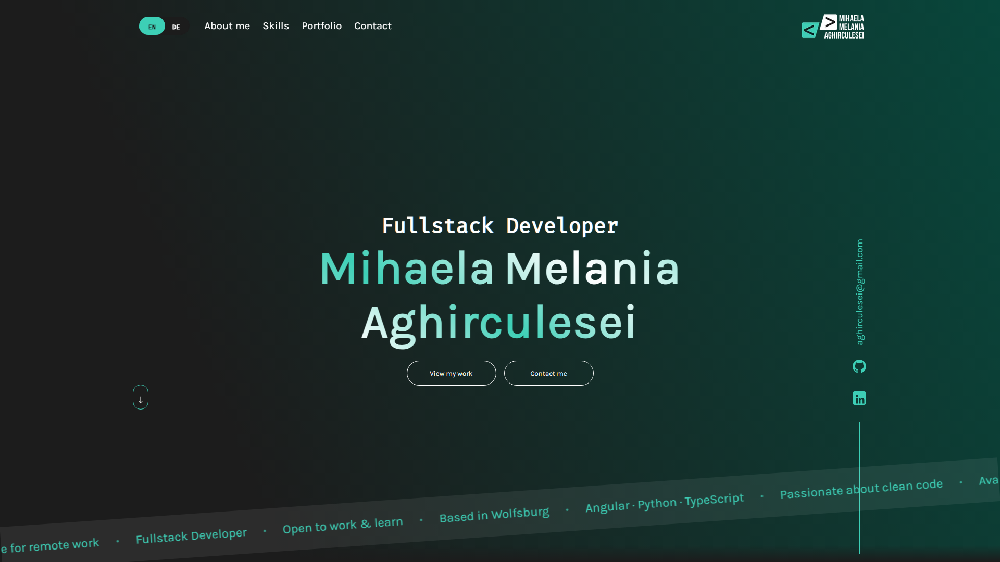
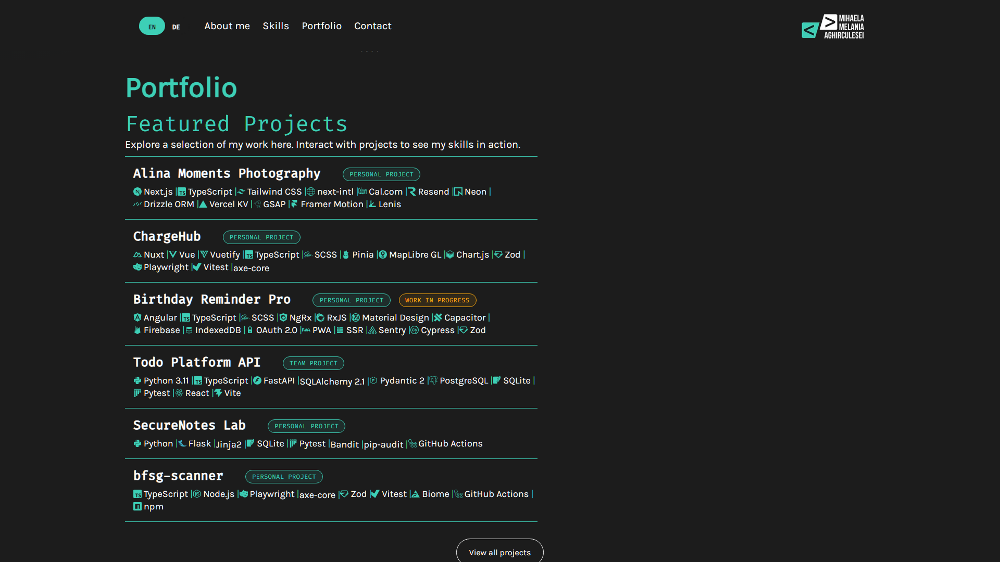

# 🚀 Portfolio - Mihaela Melania Aghirculesei

[](https://github.com/MihaelaAghirculesei/Portfolio/actions/workflows/ci.yml)
[](https://github.com/MihaelaAghirculesei/Portfolio/actions/workflows/codeql.yml)
[](LICENSE)
[](https://angular.dev/)
[](https://www.typescriptlang.org/)
[](https://aghirculesei.pages.dev)

> My developer portfolio: an Angular 21 site prerendered to static HTML, served from Cloudflare Pages, with a Cloudflare Worker behind the contact form. Every quality claim below is enforced by a check in CI.

[🌐 Live site](https://aghirculesei.pages.dev) • [📧 Contact](mailto:aghirculesei@gmail.com)

---

## 📸 Preview

<div align="center">

### Landing Page


<br>

### Portfolio Section


</div>

---

## 🏗️ Architecture

```
Browser ──► Cloudflare Pages ── prerendered HTML per route, _headers (CSP, HSTS, caching), 404.html
   │
   └──────► Cloudflare Worker "api" ── validates the contact form, rate-limits per IP (KV), sends via Resend
```

- **Static prerendering (SSG):** `outputMode: "static"` renders every route to HTML at build time. There is no server runtime; the app hydrates in the browser (zoneless change detection, event replay).
- **Real 404s:** unknown URLs get the prerendered not-found page with an HTTP 404 status (no SPA catch-all), marked `noindex`.
- **Content Security Policy without `unsafe-inline` scripts:** a postbuild step hashes every inline script the prerender emits and writes the hashes into `_headers`.
- **Contact form:** the Worker accepts only the site's origins, rejects malformed or oversized input, uses a honeypot against bots and a KV-backed per-IP rate limit, and never leaks upstream errors to the browser.
- **i18n:** English/German through a small translation service and pipe; no runtime i18n dependency.

---

## ✅ Quality gates

Everything here runs on every push and pull request ([`ci.yml`](.github/workflows/ci.yml)):

| Check | What it enforces |
|---|---|
| ESLint | Strict TypeScript rules (no `any`, explicit return types, no `console`), OnPush everywhere, Angular template accessibility rules |
| Unit tests | 735 tests with Vitest in headless Chromium; build fails below 96% statements/lines/functions and 92% branches |
| Worker tests | 21 tests for CORS, input validation, rate limiting and the Resend call (`node:test`) |
| Security audit | `npm audit` on production dependencies, plus CodeQL and dependency review on PRs |
| Smoke test | Serves the real build through Cloudflare's local Pages runtime: every route returns 200 and is in the sitemap, unknown URLs return 404, no console errors under the production CSP |
| Accessibility | [bfsg-scanner](https://github.com/MihaelaAghirculesei/bfsg-scanner) (axe-core) scans every page for WCAG 2.1 AA; any serious or critical finding fails the build, and the report is kept as an artifact |
| E2E tests | 23 Playwright tests for navigation, routing, language switching and the contact form |
| Lighthouse CI | Performance ≥ 65, accessibility/SEO/best practices ≥ 90 on five key pages (median of three runs) |
| Post-deploy check | After each deploy: live pages return 200, unknown URLs 404, CSP present, Worker CORS preflight OK |

---

## 🛠️ Tech Stack

- **Framework:** Angular 21.2 (standalone components, signals, zoneless)
- **Language:** TypeScript 5.9 (strict)
- **Styling:** SCSS
- **Testing:** Vitest (browser mode) · Playwright · node:test
- **Hosting:** Cloudflare Pages + Cloudflare Workers (KV, Resend)
- **CI/CD:** GitHub Actions, Dependabot

---

## 🚀 Getting started

Requires Node.js 22 (see `.nvmrc`).

```bash
git clone https://github.com/MihaelaAghirculesei/Portfolio.git
cd Portfolio
npm ci
npx playwright install chromium   # browser for unit, e2e and smoke tests
npm start                         # http://localhost:4200
```

### Scripts

| Command | Description |
|---|---|
| `npm start` | Development server |
| `npm run build` | Production build into `dist/angular-portfolio/browser` (prerender + postbuild steps) |
| `npm test` | Unit tests (`test:watch`, `test:coverage` for variants) |
| `npm run test:worker` | Contact-form Worker tests |
| `npm run e2e` | Playwright end-to-end tests |
| `npm run lint` / `lint:fix` | ESLint |
| `npm run ci:smoke` | Smoke test of the production build |
| `npm run ci:a11y` | Accessibility scan of the production build |
| `npm run ci:lighthouse` | Lighthouse CI against the production build |
| `npm run check:live` | Checks the deployed site |
| `npm run ci:local` | The CI quality pipeline, locally |

---

## 📁 Project structure

```
src/
├── app/
│   ├── main-content/        # Pages and sections (home, projects, case studies, contact, legal, 404)
│   ├── shared/              # Header, footer, directives, pipes, interceptors, services
│   ├── interfaces/
│   ├── app.routes.ts        # Client routes (lazy-loaded)
│   └── app.routes.server.ts # Prerender configuration
├── assets/
│   ├── data/projects.json   # Project cards (links, tech tags, preview images)
│   └── i18n/                # en.json, de.json
├── environments/
├── styles/                  # Global SCSS (variables, mixins, buttons)
├── _headers                 # Security and caching headers for Cloudflare Pages
└── sitemap.xml
cloudflare-worker/           # Contact-form Worker and its tests
scripts/                     # Postbuild steps, smoke test, accessibility scan, live check
e2e/                         # Playwright tests
```

---

## 🚢 Deployment

Pushes to `main` that pass the quality checks and E2E tests deploy automatically: the build goes to Cloudflare Pages, the Worker to Cloudflare Workers, and the live site is checked afterwards. The Worker's secrets (`RESEND_API_KEY`, `TO_EMAIL`, `FROM_EMAIL`) are set in the Cloudflare dashboard, never in the repository.

---

## 📄 License

MIT — see [LICENSE](LICENSE).

## 👤 Author

**Mihaela Melania Aghirculesei**

- 🌐 Website: [aghirculesei.pages.dev](https://aghirculesei.pages.dev)
- 💼 LinkedIn: [mihaela-aghirculesei](https://www.linkedin.com/in/mihaela-aghirculesei-84147a23b/)
- 📧 Email: aghirculesei@gmail.com
- 💻 GitHub: [@MihaelaAghirculesei](https://github.com/MihaelaAghirculesei)

---

## 🙏 Acknowledgments

- Angular Team for the amazing framework
- Developer Academy for the training and support
- The open-source community for invaluable tools and libraries

---

<div align="center">

**⭐ If you find this project interesting, please consider giving it a star! ⭐**

Made with ❤️ and Angular

</div>
